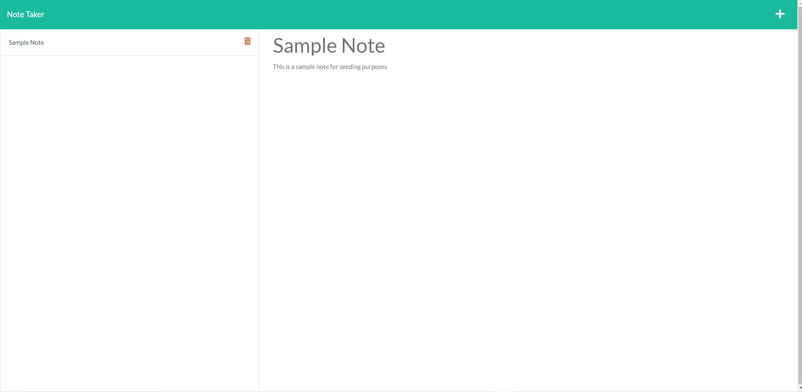

# Note Taker 

## Description

I created this application to generate an HTML page with a group of team members that will appear on cards in the main body. This application is useful if you want to organize your development team in a clean and easy way. 

## Table of Contents
- [Installation](#installation)
- [Usage](#usage)
- [License](#license)
- [Contributing](#contributing)
- [Tests](#tests)
- [Questions](#questions)
- [Credits](#credits)

## Installation

To install this note taker, the user will need to create a clone of this repository by using the command `git clone` in git bash. The user will then have to open this repository in VSCode. The user will have to have node and nodemon installed on their vscode.  

[For more information on installing npm](https://docs.npmjs.com/cli/v8/commands/npm-install)

[For more information on installing nodemon](https://www.npmjs.com/package/nodemon)

The user will then need to open the main directory in the integrated terminal and run the command `npm i` to install the neccessary dependancies for the application to run.
Then to start the application, the user will need to run `nodemon server.js` in the terminal. 

## Usage

The user will have the option to use the application VIA the [deployed site](https://floating-basin-40721.herokuapp.com/), or by installing it locally on their machine. 

- After running `nodemon index.js` the user will need to open a web application and enter `localhost:3001` in the url input.

- Upon pressing the enter key, the user will be prompted with the home page. On the home page, the user has to click "Get Started" to start entering notes.

- The user will have the ability to either enter a new note, look at an old note, or delete a note.

- To add a new note, the user has to click on the + button located on the upper right corner. After doing so, the place holder text "Note title" and "Note text" will appear. The user has to enter text in both fields to be able to save the note. 

- After entering text in both fields, the user can save a note by pressing the newly populated save button 💾 located in the upper right corner to left of the "+" button. The newly saved note will appear on the left side of the application's page. The user can then access that note by clicking on it and that note will populate it's text in the same area they typed in.

- The user will also have the ability to edit a note by clicking on the note they would like to edit and editing it's text. Upon saving the edited note, a new note will appear with the edited changes.

- To delete a note, the user needs to click on the 🗑️ button. The note will then be deleted from the database.

### Provided here is a gif of the application's functionality

## License

MIT License

Copyright &copy; 2022 Isaac Petersen

Permission is hereby granted, free of charge, to any person obtaining a copy
of this software and associated documentation files (the "Software"), to deal
in the Software without restriction, including without limitation the rights
to use, copy, modify, merge, publish, distribute, sublicense, and/or sell
copies of the Software, and to permit persons to whom the Software is
furnished to do so, subject to the following conditions:

The above copyright notice and this permission notice shall be included in all
copies or substantial portions of the Software.

THE SOFTWARE IS PROVIDED "AS IS", WITHOUT WARRANTY OF ANY KIND, EXPRESS OR
IMPLIED, INCLUDING BUT NOT LIMITED TO THE WARRANTIES OF MERCHANTABILITY,
FITNESS FOR A PARTICULAR PURPOSE AND NONINFRINGEMENT. IN NO EVENT SHALL THE
AUTHORS OR COPYRIGHT HOLDERS BE LIABLE FOR ANY CLAIM, DAMAGES OR OTHER
LIABILITY, WHETHER IN AN ACTION OF CONTRACT, TORT OR OTHERWISE, ARISING FROM,
OUT OF OR IN CONNECTION WITH THE SOFTWARE OR THE USE OR OTHER DEALINGS IN THE
SOFTWARE.

## Contributing

To contribute, please contact me via my email or through github.

## Tests

Tests ran and passed by myself.

## Questions

To contact me, use one of the links below:  
[Github profile](https://www.github.com/idpetersen)  
[Email Me](mailto:isaac.petersen5@gmail.com)

## Credits
Thank you to Joe Rehfuss for writing all the front end code for this project.
Thank you to Sabrina Hanson for collaborating with me on this project. 